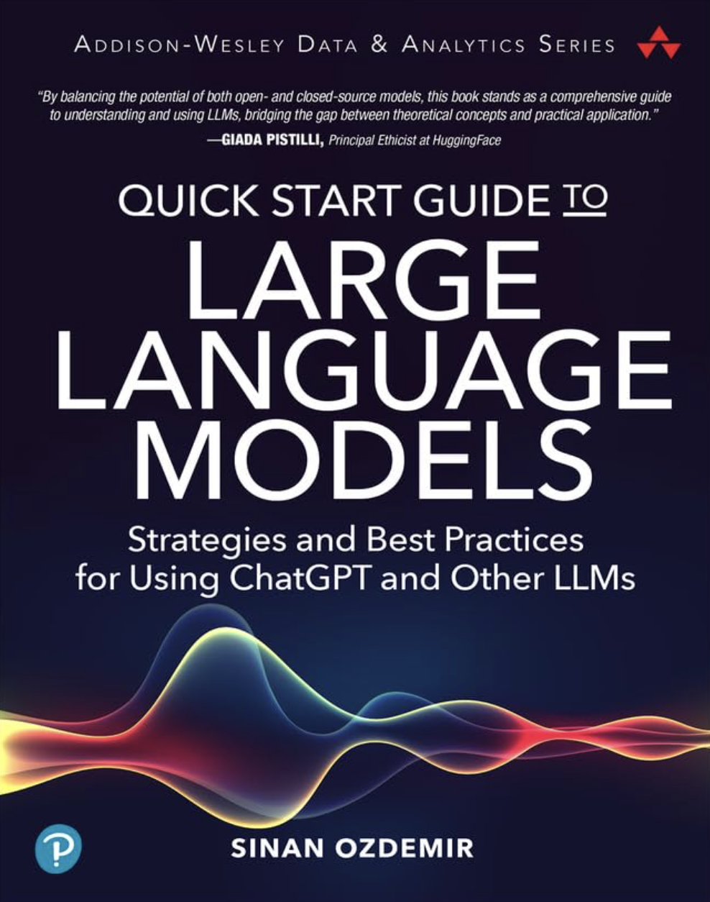

# Retrieval-Augmented Generation (RAG) and LLMs

Welcome to the "[Retrieval-Augmented Generation (RAG) and LLMs](https://learning.oreilly.com/live-events/retrieval-augmented-generation-rag-and-llms/0790145078618/0790145078600)" code repository! In this repo, we begin to understand how to augment large language models with real-time data for dynamic, context-aware apps.

Much of the code in these sessions will be featured in the 2nd edition of [my latest book on LLMs](https://www.amazon.com/quick-start-guide-language-models/dp/0138199191):

    

so if you're itching for more, check it out and please leave a rating/review to tell me what you thought :)

For even more, check out my [Expert Playlist](https://learning.oreilly.com/playlists/2953f6c7-0e13-49ac-88e2-b951e11388de)!

## Prerequisites

- **Basic to Intermediate Python Skills**: A solid understanding of Python is essential, as it will be the primary programming language used for demonstrating RAG integration with LLMs and handling real-time data.
- **Foundational Knowledge in Machine Learning and LLMs**: Familiarity with basic machine learning concepts is crucial. Additionally, having some prior knowledge of Large Language Models will be beneficial, as we will delve into more advanced topics related to augmenting these models with RAG.
- **Introductory Experience with NLP and AI Models**: A basic grasp of Natural Language Processing (NLP) and general AI model concepts will aid in understanding how RAG enhances the capabilities of these technologies in dynamic and evolving data environments.

## Installation

1. Clone this repository to your local machine.
2. Ensure you have set the following api keyes:
 - [OpenAI key](https://platform.openai.com/api-keys)
 - [Pinecone Key](https://docs.pinecone.io/guides/get-started/quickstart)
 - [Anthropic Key](https://docs.anthropic.com/en/docs/quickstart)
 - [Cohere Key](https://dashboard.cohere.com/api-keys)
 - [Huggingface Key](https://huggingface.co/settings/tokens) (if you want to deploy llama)

You're all set to explore the notebooks!

## Usage - Jupyter Notebooks

This project contains several Jupyter notebooks each focusing on a specific topic:

1. **[RAG - Retrieval](notebooks/RAG_Retrieval.ipynb)**: An introduction to vector databases, embeddings, and retrieval

	- **[FastAPI + Chatting](fastapi/)** - A simple FASTAPI implementation of our RAG app and a chat client using streamlit to test our work!
	- **[Advanced Semantic Search](https://colab.research.google.com/drive/1h8dmDclOnYsXKlMDYp1uRuW55xbzypUY?usp=sharing)**: A more advanced notebook on semantic search, cross-encoders, and fine-tuning
	- **[Advanced - Fine-tuning Embeddings For Rec Engines](https://colab.research.google.com/drive/1JfxyxdGCDjYeO52Bk1JzW4Af94xndTws?usp=sharing)**: Fine-tuning embedding engines using custom preference data
	- **[Advanced - Fine-tuning Embeddings  with Synthetic Data](https://colab.research.google.com/drive/1FOr9hgMEcTa8UJJSuKjoHpohVb-Qz-FJ?usp=sharing)** - Using GPT-4o to create synthetic queries for a corpus to increase the quality of open-source embedding models

2. **[RAG - Generation](notebooks/RAG_Generate.ipynb)**: Building a RAG chatbot using our semantic search retrieval system

	- **[Evaluating LLMs with Rubrics](https://colab.research.google.com/drive/1DeVYrdNb3FlQQLeBqGPFkx6roZaPwVRy?usp=sharing)** - Exploring a rubric prompt to evaluate generative output

	- **[First Steps with Agents](https://colab.research.google.com/drive/14jAlW2E7ya_aS1M6eUsuHciC1WvLfIif?usp=sharing)**: A natural expansion from RAG to automated AI Agents

3. **[Advanced - GraphRAG](notebooks/GraphRAG.ipynb)** - A simple introduction to GraphRAG (RAG using a knowledge graph) using Neo4J, Cohere's Re-Rank, GPT-4o, and a touch of Langchain

## References

1. Open-source models built for RAG - [Command-R by Cohere](https://cohere.com/blog/command-r?ref=cohere-ai.ghost.io)
	- Example model on [HuggingFace](https://huggingface.co/CohereForAI/c4ai-command-r-v01-4bit)

2. [Neo4J's GraphRAG Manifesto](https://neo4j.com/blog/graphrag-manifesto/)

3. [A quick-start guide to GraphRAG with LangChain](https://medium.com/data-science-in-your-pocket/graphrag-using-langchain-31b1ef8328b9) - inspired part of my GraphRAG code

## Contributing
Pull requests are welcome. For major changes, please open an issue first to discuss what you would like to change.

## Book time with me on Intro!
If you have questions, I'm available on [Intro](https://intro.co/sinanozdemir) :) 

    

